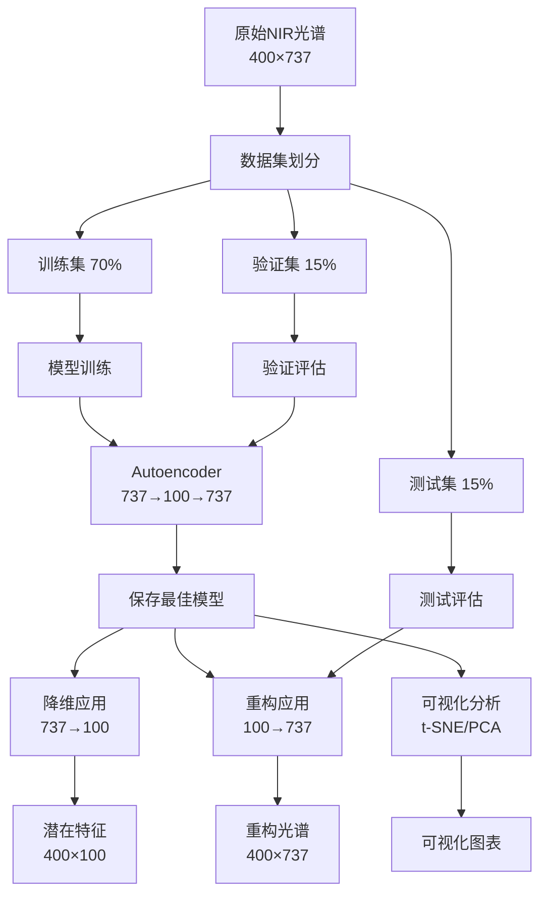

# Autoencoder NIR光谱降维系统 - 使用指南

> 完整的项目使用说明和功能详解

## 📖 如何阅读本文档

**根据您的经验水平选择阅读路径：**

### 🚀 快速上手（5分钟）
1. [快速开始](#快速开始)
2. [核心命令速查](#核心命令速查)

### 📚 完整学习（适合初学者）
1. [项目简介](#项目简介)
2. [详细使用教程](#详细使用教程)
3. [输出结果解读](#输出结果解读)
4. [常见问题](#常见问题)

### 🔧 开发定制（适合开发者）
1. [项目架构解析](#项目架构解析)
2. [参数配置详解](#参数配置详解)
3. [开发者指南](#开发者指南)

---

## 📋 目录

- [项目简介](#项目简介)
- [快速开始](#快速开始)
- [核心命令速查](#核心命令速查)
- [详细使用教程](#详细使用教程)
- [输出结果解读](#输出结果解读)
- [项目架构解析](#项目架构解析)
- [参数配置详解](#参数配置详解)
- [开发者指南](#开发者指南)
- [常见问题](#常见问题)
- [性能优化建议](#性能优化建议)

---

## 项目简介

### 项目背景

近红外（NIR）光谱分析是一种非破坏性的快速检测技术，广泛应用于农产品质量检测。然而，原始NIR光谱数据维度高（本项目737维），存在以下问题：

- **存储成本高**：大规模光谱数据库占用大量存储空间
- **计算效率低**：高维数据处理速度慢
- **难以可视化**：无法直观展示样本分布
- **冗余信息多**：相邻波段存在较强相关性

本项目通过Autoencoder深度学习模型，实现了**无监督降维**和**特征重构**，有效解决上述问题。

### 技术特点

- **无监督学习**：不需要标签数据，自动学习光谱的低维表示
- **端到端训练**：编码器和解码器联合优化，确保重构质量
- **SELU激活**：自归一化激活函数，训练稳定性好
- **高压缩比**：7.37倍压缩，节省86.4%存储空间
- **高保真重构**：相关系数>0.98，保留原始光谱主要信息

### 适用场景

- ✅ 大规模光谱数据的存储和管理
- ✅ 为机器学习分类/回归任务提供低维特征
- ✅ 光谱数据的可视化分析和聚类
- ✅ 农产品质量异常检测
- ✅ 产地溯源和真伪鉴别

### 前置要求

**必须**：
- 已完成环境配置（参见[环境配置.md](环境配置.md)）
- Python 3.8-3.10环境
- 基本的命令行操作知识

**推荐**（非必须）：
- 了解基本的深度学习概念
- 熟悉Python编程
- 了解光谱分析基础

---

## 快速开始

### 三步启动流程

```bash
# 步骤1：激活环境
conda activate autoencoder_env

# 步骤2：进入项目目录
cd "你的项目路径"

# 步骤3：运行快速测试
python quick_start.py
```

### 完整工作流

```bash
# 1. 快速体验（30秒）
python quick_start.py

# 2. 训练模型（5-10分钟）
python train.py

# 3. 降维应用
python dimension_reduction.py --mode batch

# 4. 重构演示
python reconstruct.py --mode single

# 5. 可视化分析（1-2分钟）
python visualize.py
```

---

## 核心命令速查

### 基础操作

```bash
# 环境激活
conda activate autoencoder_env

# 快速测试
python quick_start.py

# 完整训练
python train.py

# 批量降维
python dimension_reduction.py --mode batch

# 单样本降维
python dimension_reduction.py --mode single

# 单样本重构
python reconstruct.py --mode single

# 批量重构评估
python reconstruct.py --mode batch

# 从潜在特征重构
python reconstruct.py --mode latent

# 生成所有可视化
python visualize.py
```

### 配置查看

```python
# 在Python中查看配置
import config
print(f"输入维度: {config.INPUT_DIM}")
print(f"潜在维度: {config.LATENT_DIM}")
print(f"压缩比: {config.INPUT_DIM / config.LATENT_DIM:.2f}x")
print(f"使用设备: {config.DEVICE}")
```

---

## 详细使用教程

### 步骤1：快速测试程序

**目的**：快速了解项目功能，验证环境配置

#### 运行命令

```bash
python quick_start.py
```

#### 程序流程

1. **生成模拟数据**：创建40个NIR光谱样本（8种农产品×5个样本）
2. **构建模型**：创建Autoencoder模型（737→100→737）
3. **演示编码-解码**：展示降维和重构过程
4. **简单训练**：运行10个epoch的快速训练
5. **保存结果**：生成训练曲线和样本图

#### 输出示例

```
=== Autoencoder NIR光谱降维 - 快速开始演示 ===

步骤1: 生成模拟NIR光谱数据
已生成 40 个样本，8 种农产品
光谱维度: 737 (9100.0 - 3900.0 cm⁻¹)

步骤2: 创建Autoencoder模型
模型结构:
  输入维度: 737
  潜在维度: 100
  激活函数: SELU
  压缩比: 7.37x

步骤3: 编码-解码演示
原始光谱: 737维
编码后: 100维 (节省 86.44% 空间)
重构光谱: 737维

步骤4: 简单训练演示 (10 epochs)
Epoch 1/10 - Loss: 0.0234
Epoch 2/10 - Loss: 0.0156
...
训练完成！

✅ 快速开始演示完成！
生成的图表:
  - results/sample_spectra.png (样本光谱)
  - results/encode_decode_demo.png (编码-解码示例)
  - results/simple_training_curve.png (训练曲线)
```

#### 重点说明

- **数据生成**：自动生成模拟NIR光谱，包含8种农产品的特征
- **模型创建**：单隐层Autoencoder，结构简单高效
- **快速训练**：仅10轮，用于演示，完整训练需运行train.py
- **可视化输出**：所有图表保存在`results/`目录

---

### 步骤2：完整模型训练

**目的**：训练高质量的Autoencoder模型，用于后续降维和重构

#### 运行命令

```bash
python train.py
```

#### 详细流程

##### 阶段1：数据准备

```
加载或生成数据: 400个样本 (8种农产品 × 50样本)
数据划分:
  - 训练集: 280 (70%)
  - 验证集: 60 (15%)
  - 测试集: 60 (15%)
```

##### 阶段2：模型训练

```
训练配置:
  - 批次大小: 32
  - 学习率: 0.001
  - 优化器: Adam
  - 损失函数: MSE
  - 最大轮数: 50
  - 早停: 10轮无改善则停止

训练过程:
Epoch [1/50] - Train Loss: 0.0234 | Val Loss: 0.0256 | LR: 0.0010
Epoch [2/50] - Train Loss: 0.0156 | Val Loss: 0.0178 | LR: 0.0010
...
Epoch [35/50] - Train Loss: 0.0012 | Val Loss: 0.0018 | LR: 0.0005
```

##### 阶段3：模型评估

```
测试集评估:
  - MSE: 0.0021
  - RMSE: 0.0458
  - MAE: 0.0324
  - PSNR: 26.78 dB
  - Correlation: 0.9876
```

##### 阶段4：保存结果

```
模型保存: saved_models/autoencoder_best.pth
训练结果: results/training_results.json
训练曲线: results/training_curves.png
```

#### 时间估算

| 阶段 | CPU时间 | GPU时间 |
|------|---------|---------|
| 数据准备 | 10秒 | 10秒 |
| 模型训练 | 5-8分钟 | 2-3分钟 |
| 模型评估 | 5秒 | 2秒 |
| 保存结果 | 2秒 | 2秒 |
| **总计** | **6-10分钟** | **3-5分钟** |

#### 注意事项

1. **设备选择**：默认使用CPU，如需GPU加速，修改`config.py`中的`DEVICE_MODE = 'auto'`
2. **早停机制**：如果验证损失10轮没有改善，会提前停止训练
3. **学习率调度**：验证损失5轮无改善，学习率会减半
4. **断点续训**：如果训练中断，删除模型文件后重新运行

---

### 步骤3：降维应用

**目的**：将737维光谱压缩到100维潜在特征

#### 批量降维（推荐）

```bash
python dimension_reduction.py --mode batch
```

**输出**：
```
加载训练好的模型...
加载数据集: 400个样本

批量降维中...
100%|████████████████████| 400/400 [00:02<00:00, 156.78it/s]

降维完成！
原始维度: 737
压缩维度: 100
压缩比: 7.37x
空间节省: 86.44%

结果保存:
  - results/latent_features.npy (潜在特征)
  - results/latent_labels.npy (对应标签)
```

**应用场景**：
- 大规模光谱数据压缩存储
- 为分类/回归模型提供低维特征输入
- 进行聚类分析前的预处理

#### 单样本降维

```bash
python dimension_reduction.py --mode single
```

**输出**：
```
随机选择5个样本进行降维演示...

样本1 [红豆]:
  原始维度: 737
  降维后: 100
  压缩比: 7.37x

样本2 [当归]:
  原始维度: 737
  降维后: 100
  压缩比: 7.37x
...
```

**应用场景**：
- 了解降维过程
- 检查特定样本的潜在特征
- 调试和验证

---

### 步骤4：重构应用

**目的**：从潜在特征重构回原始光谱，评估重构质量

#### 单样本重构

```bash
python reconstruct.py --mode single
```

**输出**：
```
随机选择5个样本进行重构演示...

样本1 [红豆]:
  MSE: 0.0018
  MAE: 0.0312
  Correlation: 0.9891

样本2 [当归]:
  MSE: 0.0021
  MAE: 0.0345
  Correlation: 0.9876
...

重构对比图已保存: results/reconstruction_comparison.png
```

**生成图表**：
- 5个样本的原始vs重构光谱对比图
- 直观展示重构质量

#### 批量重构评估

```bash
python reconstruct.py --mode batch
```

**输出**：
```
测试集重构评估 (60个样本)

整体指标:
  MSE:         0.0021
  RMSE:        0.0458
  MAE:         0.0324
  PSNR:        26.78 dB
  Correlation: 0.9876

各产品重构性能:
红豆    - MSE: 0.0019, Corr: 0.9885
当归    - MSE: 0.0023, Corr: 0.9871
胡萝卜  - MSE: 0.0020, Corr: 0.9879
...
```

#### 从潜在特征重构

```bash
python reconstruct.py --mode latent
```

**前置条件**：需先运行`dimension_reduction.py --mode batch`生成潜在特征

**输出**：
```
加载潜在特征: results/latent_features.npy
特征形状: (400, 100)

重构光谱...
100%|████████████████████| 400/400 [00:01<00:00, 234.56it/s]

重构完成！
重构光谱形状: (400, 737)
结果保存: results/reconstructed_spectra.npy
```

**应用场景**：
- 从压缩存储的潜在特征恢复原始光谱
- 验证存储-恢复流程的完整性

---

### 步骤5：可视化分析

**目的**：可视化潜在空间，分析不同农产品的分布特征

#### 运行命令

```bash
python visualize.py
```

#### 生成图表

1. **t-SNE潜在空间投影**（`results/latent_space_tsne.png`）
   - 将100维潜在特征降维到2维
   - 不同颜色代表不同农产品
   - 展示样本的聚类分布

2. **PCA潜在空间投影**（`results/latent_space_pca.png`）
   - 线性降维方法，速度快
   - 保留主要变化方向

3. **潜在特征分布**（`results/latent_distribution.png`）
   - 前10个潜在维度的分布
   - 箱线图展示各维度的统计特性

4. **重构样本对比**（`results/reconstruction_samples.png`）
   - 随机选择样本的原始vs重构对比
   - 直观评估重构质量

#### 输出示例

```
生成可视化图表...

1/4: 提取潜在特征... ✓
2/4: t-SNE降维 (可能需要1-2分钟)... ✓
3/4: PCA降维... ✓
4/4: 绘制图表... ✓

所有可视化已保存到 results/ 目录:
  ✓ latent_space_tsne.png
  ✓ latent_space_pca.png
  ✓ latent_distribution.png
  ✓ reconstruction_samples.png
```

#### 注意事项

- **t-SNE计算较慢**：对于400个样本，需要1-2分钟
- **随机性**：t-SNE每次运行结果略有不同（已设置随机种子保证可重复）
- **解读聚类**：相同颜色的点应该聚集在一起，表示模型学到了有意义的特征

---

## 输出结果解读

### 评估指标详解

#### MSE (均方误差)

**定义**：Mean Squared Error，预测值与真实值差的平方的平均值

**计算公式**：
$$\text{MSE} = \frac{1}{n}\sum_{i=1}^{n}(y_i - \hat{y}_i)^2$$

式中，$$y_i$$为原始光谱值；$$\hat{y}_i$$为重构光谱值；$$n$$为波段点数量。

**意义**：
- MSE越小，重构误差越小
- 对大误差更敏感（平方惩罚）
- 典型值范围：0.001 - 0.005（本项目）

#### RMSE (均方根误差)

**定义**：Root Mean Squared Error，MSE的平方根

**计算公式**：
$$\text{RMSE} = \sqrt{\text{MSE}} = \sqrt{\frac{1}{n}\sum_{i=1}^{n}(y_i - \hat{y}_i)^2}$$

式中，符号含义同上。

**意义**：
- 与原始数据单位一致
- 更直观的误差度量
- 典型值范围：0.03 - 0.07（本项目）

#### MAE (平均绝对误差)

**定义**：Mean Absolute Error，预测值与真实值绝对差的平均值

**计算公式**：
$$\text{MAE} = \frac{1}{n}\sum_{i=1}^{n}|y_i - \hat{y}_i|$$

式中，符号含义同上。

**意义**：
- 对异常值不敏感
- 平均重构偏差
- 典型值范围：0.02 - 0.05（本项目）

#### PSNR (峰值信噪比)

**定义**：Peak Signal-to-Noise Ratio，信号质量评估指标

**计算公式**：
$$\text{PSNR} = 10 \cdot \log_{10}\left(\frac{\text{MAX}^2}{\text{MSE}}\right)$$

式中，$$\text{MAX}$$为信号最大值。

**意义**：
- 单位：dB（分贝）
- PSNR越高，重构质量越好
- 典型值范围：25 - 35 dB（本项目）
- >30 dB：优秀
- 25-30 dB：良好
- <25 dB：一般

#### Correlation (相关系数)

**定义**：原始光谱与重构光谱的Pearson相关系数

**计算公式**：
$$r = \frac{\sum_{i=1}^{n}(y_i - \bar{y})(\hat{y}_i - \bar{\hat{y}})}{\sqrt{\sum_{i=1}^{n}(y_i - \bar{y})^2}\sqrt{\sum_{i=1}^{n}(\hat{y}_i - \bar{\hat{y}})^2}}$$

式中，$$\bar{y}$$和$$\bar{\hat{y}}$$分别为原始和重构光谱的均值。

**意义**：
- 范围：-1 到 1
- 越接近1，线性相关性越强
- 典型值范围：>0.98（本项目）
- >0.99：优秀
- 0.95-0.99：良好
- <0.95：需改进

### 训练曲线解读

#### 正常训练曲线

```
Loss
 ^
 |  \
 |   \___     训练损失
 |       \___
 |           \___
 |       验证损失___
 |                  ---___
 +-----------------------> Epoch
```

**特征**：
- 训练和验证损失都在下降
- 验证损失略高于训练损失
- 后期趋于平稳

#### 过拟合曲线

```
Loss
 ^
 |  \         训练损失
 |   \___________
 |               -----
 |   验证损失
 |       ___---
 |  ___/
 +-----------------------> Epoch
```

**特征**：
- 训练损失持续下降
- 验证损失先降后升
- 需要早停或增加正则化

---

## 项目架构解析

### 目录结构详解

```
自编码器（Autoencoder）用于谱图降维及特征重构/
│
├── config.py                 # 全局配置文件
│                             # 包含所有超参数、路径配置、设备配置
│
├── train.py                  # 训练脚本
│                             # 完整的训练流程：数据加载→训练→评估→保存
│
├── dimension_reduction.py    # 降维脚本
│                             # 使用编码器将737维压缩到100维
│
├── reconstruct.py            # 重构脚本
│                             # 使用解码器从100维重构到737维
│
├── visualize.py              # 可视化脚本
│                             # 生成t-SNE、PCA等可视化图表
│
├── quick_start.py            # 快速开始演示
│                             # 新用户快速了解项目功能
│
├── requirements.txt          # Python依赖包列表
│
├── models/                   # 模型定义模块
│   ├── __init__.py           # 模块初始化
│   └── autoencoder.py        # Autoencoder类定义
│                             # 包含Encoder、Decoder、完整模型
│
├── data/                     # 数据处理模块
│   ├── __init__.py           # 模块初始化
│   └── data_generator.py     # NIR光谱数据生成器
│                             # 生成模拟的8种农产品光谱数据
│
├── utils/                    # 工具函数模块
│   ├── __init__.py           # 模块初始化
│   ├── dataset.py            # PyTorch数据集类
│   └── metrics.py            # 评估指标函数（MSE、PSNR等）
│
├── saved_models/             # 模型保存目录
│   └── autoencoder_best.pth  # 训练好的最佳模型（训练后生成）
│
├── results/                  # 结果保存目录
│   ├── training_curves.png   # 训练曲线
│   ├── latent_features.npy   # 潜在特征
│   └── ...                   # 其他可视化图表
│
└── logs/                     # 日志目录
    └── training.log          # 训练日志（可选）
```

### 数据流向



### 模型架构详解

#### Autoencoder整体结构

```
输入: x ∈ R^737 (NIR光谱)
    ↓
┌─────────────────┐
│  Encoder编码器   │
│  Linear(737,100) │
│     + SELU      │
└─────────────────┘
    ↓
潜在空间: z ∈ R^100 (压缩表示)
    ↓
┌─────────────────┐
│  Decoder解码器   │
│  Linear(100,737) │
│     + SELU      │
└─────────────────┘
    ↓
输出: x' ∈ R^737 (重构光谱)

损失函数: L = MSE(x, x')
```

**特点**：
- **单隐层结构**：简单高效，训练快速
- **对称架构**：编码器和解码器结构对称
- **SELU激活**：Self-Normalizing，训练稳定
- **无偏置项**：减少参数量

#### 编码器（Encoder）

```python
class Encoder(nn.Module):
    def __init__(self, input_dim=737, latent_dim=100):
        self.fc = nn.Linear(input_dim, latent_dim)
        self.activation = nn.SELU()
    
    def forward(self, x):
        return self.activation(self.fc(x))
```

**功能**：提取光谱的低维特征表示
**参数量**：737×100 = 73,700

#### 解码器（Decoder）

```python
class Decoder(nn.Module):
    def __init__(self, latent_dim=100, output_dim=737):
        self.fc = nn.Linear(latent_dim, output_dim)
        self.activation = nn.SELU()
    
    def forward(self, z):
        return self.activation(self.fc(z))
```

**功能**：从潜在特征重构原始光谱
**参数量**：100×737 = 73,700

**总参数量**：147,400 (约0.15M)

---

## 参数配置详解

所有配置参数在`config.py`文件中集中管理。

### 数据配置

```python
# 光谱数据配置
INPUT_DIM = 737                      # 光谱波段点数
WAVENUMBER_RANGE = (9100, 3900)      # 波数范围 (cm⁻¹)

# 农产品配置
PRODUCT_NAMES = [
    '红豆', '当归', '胡萝卜', '大蒜', 
    '生姜', '人参', '大豆', '小麦'
]
NUM_PRODUCTS = 8                      # 农产品种类数

# 样本配置
SAMPLES_PER_PRODUCT = 50              # 每种农产品样本数
TOTAL_SAMPLES = 400                   # 总样本数
```

**修改建议**：
- 如需使用自己的数据，修改`INPUT_DIM`和`PRODUCT_NAMES`
- 调整`SAMPLES_PER_PRODUCT`可控制数据集大小

### 模型配置

```python
# Autoencoder结构
LATENT_DIM = 100                      # 潜在空间维度
ACTIVATION = 'SELU'                   # 激活函数

MODEL_CONFIG = {
    'input_dim': 737,
    'latent_dim': 100,
    'activation': 'SELU',
}
```

**修改建议**：

| 参数 | 增大效果 | 减小效果 | 推荐值 |
|------|----------|----------|--------|
| `LATENT_DIM` | 重构质量↑，压缩率↓ | 压缩率↑，重构质量↓ | 50-200 |
| `ACTIVATION` | SELU(稳定), ReLU(快), Tanh(平滑) | - | SELU |

### 训练配置

```python
# 基本参数
BATCH_SIZE = 32                       # 批次大小
EPOCHS = 50                           # 最大训练轮数
LEARNING_RATE = 0.001                 # 初始学习率
WEIGHT_DECAY = 1e-5                   # 权重衰减（L2正则）

# 早停策略
EARLY_STOPPING_PATIENCE = 10          # 早停耐心值

# 学习率调度
LR_SCHEDULER = {
    'type': 'ReduceLROnPlateau',
    'factor': 0.5,                    # 学习率衰减因子
    'patience': 5,                    # 等待轮数
    'min_lr': 1e-6,                   # 最小学习率
}
```

**修改建议**：

| 参数 | 增大效果 | 减小效果 | 推荐值 |
|------|----------|----------|--------|
| `BATCH_SIZE` | 训练快，内存占用↑ | 训练慢，内存占用↓ | 16-64 |
| `EPOCHS` | 训练更充分 | 训练不足 | 30-100 |
| `LEARNING_RATE` | 收敛快，可能震荡 | 收敛慢，更稳定 | 0.0001-0.01 |

### 设备配置

```python
# 设备选择
DEVICE_MODE = 'cpu'                   # 'cpu', 'cuda', 'auto'

def get_device():
    # 自动检测并返回可用设备
    ...
```

**修改方法**：
1. 打开`config.py`
2. 修改`DEVICE_MODE`：
   - `'cpu'`：强制CPU（默认，兼容性最好）
   - `'cuda'`：强制GPU（需要兼容GPU）
   - `'auto'`：自动检测（有GPU则用GPU）
3. 保存并重新运行程序

### 可视化配置

```python
# t-SNE配置
TSNE_CONFIG = {
    'n_components': 2,                # 降维目标维度
    'perplexity': 30,                 # 困惑度
    'n_iter': 1000,                   # 最大迭代次数
    'random_state': 42,               # 随机种子
}

# PCA配置
PCA_CONFIG = {
    'n_components': 2,                # 主成分数量
}
```

**修改建议**：
- `perplexity`：样本数较少时可降低（10-50）
- `n_iter`：增加可提高质量，但更慢（500-3000）

---

## 开发者指南

### 如何使用自己的NIR光谱数据

#### 方法1：替换生成的数据文件

**步骤1**：准备数据

将您的光谱数据保存为NumPy数组：

```python
import numpy as np

# 假设您有N个样本，每个737维
your_spectra = np.array(...)  # shape: (N, 737)
your_labels = np.array(...)   # shape: (N,), 农产品类别 0-7
your_origins = np.array(...)  # shape: (N,), 产地 0(国产)或1(进口)

# 保存到data目录
np.save('data/spectra.npy', your_spectra)
np.save('data/labels.npy', your_labels)
np.save('data/origins.npy', your_origins)
```

**步骤2**：修改配置（如果维度不同）

```python
# config.py

INPUT_DIM = 你的光谱维度  # 例如：1024
PRODUCT_NAMES = ['类别1', '类别2', ...]
```

**步骤3**：训练模型

```bash
python train.py
```

#### 方法2：修改数据生成器

编辑`data/data_generator.py`，添加自定义数据加载函数：

```python
def load_custom_data(data_path):
    """
    加载自定义NIR光谱数据
    
    参数:
        data_path: 数据文件路径
    
    返回:
        spectra: 光谱数据 (N, D)
        labels: 类别标签 (N,)
        origins: 产地标签 (N,)
    """
    # 实现您的数据加载逻辑
    spectra = ...
    labels = ...
    origins = ...
    
    return spectra, labels, origins
```

### 如何调整模型结构

#### 添加更多隐层

编辑`models/autoencoder.py`：

```python
class Autoencoder(nn.Module):
    def __init__(self, input_dim=737, hidden_dims=[512, 256, 100]):
        super(Autoencoder, self).__init__()
        
        # 构建编码器
        encoder_layers = []
        in_dim = input_dim
        for hidden_dim in hidden_dims:
            encoder_layers.append(nn.Linear(in_dim, hidden_dim))
            encoder_layers.append(nn.SELU())
            in_dim = hidden_dim
        self.encoder = nn.Sequential(*encoder_layers)
        
        # 构建解码器（对称结构）
        decoder_layers = []
        for i in range(len(hidden_dims) - 1, -1, -1):
            out_dim = hidden_dims[i-1] if i > 0 else input_dim
            decoder_layers.append(nn.Linear(in_dim, out_dim))
            decoder_layers.append(nn.SELU())
            in_dim = out_dim
        self.decoder = nn.Sequential(*decoder_layers)
    
    def forward(self, x):
        z = self.encoder(x)
        x_recon = self.decoder(z)
        return x_recon, z
```

#### 使用变分自编码器（VAE）

```python
class VAE(nn.Module):
    def __init__(self, input_dim=737, latent_dim=100):
        super(VAE, self).__init__()
        
        # 编码器
        self.encoder = nn.Sequential(
            nn.Linear(input_dim, 256),
            nn.SELU(),
        )
        
        # 均值和方差
        self.fc_mu = nn.Linear(256, latent_dim)
        self.fc_logvar = nn.Linear(256, latent_dim)
        
        # 解码器
        self.decoder = nn.Sequential(
            nn.Linear(latent_dim, 256),
            nn.SELU(),
            nn.Linear(256, input_dim),
            nn.SELU(),
        )
    
    def encode(self, x):
        h = self.encoder(x)
        return self.fc_mu(h), self.fc_logvar(h)
    
    def reparameterize(self, mu, logvar):
        std = torch.exp(0.5 * logvar)
        eps = torch.randn_like(std)
        return mu + eps * std
    
    def decode(self, z):
        return self.decoder(z)
    
    def forward(self, x):
        mu, logvar = self.encode(x)
        z = self.reparameterize(mu, logvar)
        x_recon = self.decode(z)
        return x_recon, mu, logvar
```

### 如何添加新的评估指标

编辑`utils/metrics.py`：

```python
def spectral_angle_mapper(y_true, y_pred):
    """
    光谱角度映射(SAM)
    
    参数:
        y_true: 原始光谱 (N, D)
        y_pred: 重构光谱 (N, D)
    
    返回:
        sam: 光谱角度 (弧度)
    """
    dot_product = np.sum(y_true * y_pred, axis=1)
    norm_true = np.linalg.norm(y_true, axis=1)
    norm_pred = np.linalg.norm(y_pred, axis=1)
    
    cos_theta = dot_product / (norm_true * norm_pred)
    sam = np.arccos(np.clip(cos_theta, -1, 1))
    
    return np.mean(sam)
```

---

## 常见问题

### 训练相关

**Q1: 训练损失不下降怎么办？**

A: 可能的原因和解决方案：
1. **学习率过大**：降低学习率`LEARNING_RATE = 0.0001`
2. **学习率过小**：增大学习率`LEARNING_RATE = 0.01`
3. **模型容量不足**：增加`LATENT_DIM`或添加隐层
4. **数据问题**：检查数据是否正确加载和归一化

**Q2: 训练过拟合怎么办？**

A: 解决方案：
1. **增加权重衰减**：`WEIGHT_DECAY = 1e-4`
2. **添加Dropout**：在模型中添加Dropout层
3. **减少模型容量**：降低`LATENT_DIM`
4. **增加训练数据**：提高`SAMPLES_PER_PRODUCT`
5. **使用早停**：已默认启用，耐心值10轮

**Q3: 如何恢复中断的训练？**

A: 目前不支持断点续训，如果训练中断：
1. 删除`saved_models/autoencoder_best.pth`
2. 重新运行`python train.py`

### 预测相关

**Q4: 重构误差很大怎么办？**

A: 诊断和解决：
1. **检查模型**：确保使用的是训练好的模型
2. **增加训练轮数**：`EPOCHS = 100`
3. **增加潜在维度**：`LATENT_DIM = 150`或`200`
4. **尝试其他激活函数**：`ACTIVATION = 'ReLU'`
5. **检查数据范围**：确保测试数据与训练数据分布一致

**Q5: 潜在特征全是0或NaN？**

A: 可能原因：
1. **模型未训练**：先运行`python train.py`
2. **模型加载失败**：检查模型文件是否存在和完整
3. **输入数据异常**：检查输入数据是否包含NaN或Inf

### 环境相关

**Q6: ImportError: No module named 'xxx'**

A: 重新安装依赖：
```bash
pip install -r requirements.txt
```

**Q7: CUDA out of memory**

A: 显存不足，解决方案：
1. 减小批次大小：`BATCH_SIZE = 16`或`8`
2. 使用CPU模式：`DEVICE_MODE = 'cpu'`
3. 清理显存缓存：
```python
import torch
torch.cuda.empty_cache()
```

**Q8: RuntimeError: CUDA error**

A: GPU相关错误，最简单的解决方案：
```python
# config.py
DEVICE_MODE = 'cpu'
```

---

## 性能优化建议

### 训练优化

#### 1. 使用GPU加速

```python
# config.py
DEVICE_MODE = 'auto'  # 自动检测并使用GPU
```

**效果**：训练速度提升2-5倍

#### 2. 增大批次大小

```python
# config.py
BATCH_SIZE = 64  # 如果内存充足
```

**效果**：提高GPU利用率，加快训练

#### 3. 混合精度训练

```python
# 在train.py中添加
from torch.cuda.amp import autocast, GradScaler

scaler = GradScaler()

for batch in dataloader:
    with autocast():
        output = model(batch)
        loss = criterion(output, target)
    
    scaler.scale(loss).backward()
    scaler.step(optimizer)
    scaler.update()
```

**效果**：节省显存，加快训练（需要GPU支持）

### 推理优化

#### 1. 批量推理

```python
# 批量降维比单个推理快得多
python dimension_reduction.py --mode batch
```

**效果**：提升推理速度10-20倍

#### 2. 模型量化

```python
# 量化模型以减少内存占用
import torch

model = torch.load('saved_models/autoencoder_best.pth')
quantized_model = torch.quantization.quantize_dynamic(
    model, {torch.nn.Linear}, dtype=torch.qint8
)
```

**效果**：减少模型大小75%，略微降低精度

### 存储优化

#### 1. 压缩潜在特征

```python
import numpy as np

# 保存为16位浮点数
latent_features = latent_features.astype(np.float16)
np.save('latent_features_fp16.npy', latent_features)
```

**效果**：文件大小减半，精度略降

#### 2. 使用压缩格式

```python
# 保存为压缩的npz格式
np.savez_compressed('latent_features.npz', 
                    features=latent_features,
                    labels=labels)
```

**效果**：文件大小减少50-80%

---

## 附录

### A. 术语表

| 术语 | 说明 |
|------|------|
| **Autoencoder** | 自编码器，一种无监督学习的神经网络 |
| **编码器（Encoder）** | 将高维数据压缩到低维潜在空间的网络部分 |
| **解码器（Decoder）** | 从低维潜在空间重构高维数据的网络部分 |
| **潜在空间（Latent Space）** | 压缩后的低维特征表示空间 |
| **重构误差（Reconstruction Error）** | 原始数据与重构数据之间的差异 |
| **NIR光谱** | Near-Infrared Spectroscopy，近红外光谱 |
| **降维（Dimensionality Reduction）** | 减少数据维度，保留主要信息 |
| **t-SNE** | t-Distributed Stochastic Neighbor Embedding，非线性降维方法 |
| **PCA** | Principal Component Analysis，主成分分析 |
| **SELU** | Scaled Exponential Linear Unit，自归一化激活函数 |

### B. 参考资料

**深度学习基础**：
- PyTorch官方教程：https://pytorch.org/tutorials/
- 深度学习书籍：《深度学习》（Goodfellow等著）

**Autoencoder相关**：
- 原始论文：Hinton & Salakhutdinov (2006) "Reducing the Dimensionality of Data with Neural Networks"
- 变分自编码器：Kingma & Welling (2013) "Auto-Encoding Variational Bayes"

**光谱分析**：
- NIR光谱技术应用综述
- 近红外光谱分析在农产品检测中的应用

### C. 项目信息

- **版本**：v1.0
- **最后更新**：2025-10-27
- **Python版本**：3.8 - 3.10
- **主要依赖**：PyTorch 1.10+, NumPy 1.21+, scikit-learn 1.0+

### D. 完整工作流程示例

```bash
# 1. 环境配置（首次使用）
conda create -n autoencoder_env python=3.9 -y
conda activate autoencoder_env
pip install -r requirements.txt

# 2. 快速体验（30秒）
python quick_start.py

# 3. 完整训练（5-10分钟）
python train.py

# 4. 降维应用
python dimension_reduction.py --mode batch

# 5. 重构评估
python reconstruct.py --mode single
python reconstruct.py --mode batch

# 6. 可视化分析（1-2分钟）
python visualize.py

# 完成！查看results/目录中的所有结果
```

---

**祝您使用愉快！** 🎉

如有任何问题，请参考：
- 📖 [环境配置.md](环境配置.md) - 环境安装问题
- 📖 [README.md](README.md) - 项目概览
- 💬 本文档的"常见问题"章节
